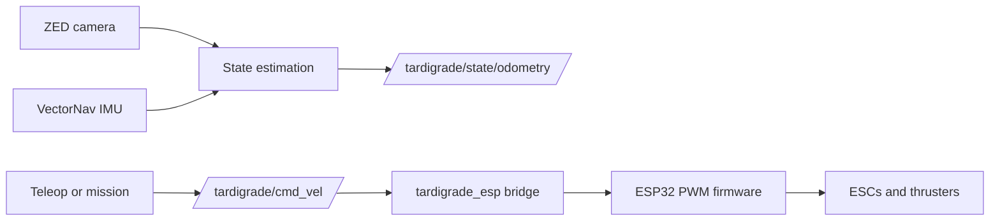

# Tardigrade ROS 2 Workspace

This repository contains the ROS 2 Foxy workspace for the Berkeley AUV
Tardigrade. Development is Docker-based so laptops and the Jetson use the same
ROS toolchain.

Most day-to-day work can happen locally without the ZED, VectorNav, ESP32, or
thrusters.

## System Flow

The current hardware direction is ESP-first:



For local development, `tardigrade_sim` can replace hardware with fake status,
odometry, and perception topics.

## Repository Guides

- [SETUP.md](SETUP.md): set up the repo, Docker container, Jetson host, and
  Foxglove.
- [SCRIPTS.md](SCRIPTS.md): root helper scripts, launch files, and ROS console
  commands.
- [CONTRIBUTING.md](CONTRIBUTING.md): local checks and PR expectations.
- [robot/README.md](robot/README.md): robot-host setup, udev rules, and
  autostart files.
- [foxglove/README.md](foxglove/README.md): visualization setup and layout
  notes.
- [docs/](docs): detailed runbooks that should version with the code.

## Clone

Clone recursively so vendor submodules are present:

```bash
git clone --recurse-submodules https://github.com/berkeleyauv/tardigrade_ws.git
cd tardigrade_ws
```

If the repo was cloned without submodules:

```bash
git submodule update --init --recursive
```

External source layout:

```text
src/vectornav             VectorNav ROS 2 driver/messages
src/zed-ros2-wrapper      Stereolabs ZED wrapper
  zed-ros2-interfaces     Nested submodule owned by zed-ros2-wrapper
src/ROS-TCP-Endpoint      Unity ROS-TCP endpoint
```

## Build Packages

Start the development container:

```bash
./docker-build.sh --build
```

Inside the container:

```bash
cd /ws
rosdep update
rosdep install --from-paths src --ignore-src -r -y
./build.sh
source install/setup.bash
```

`./build.sh` skips ZED SDK packages by default because those only build on the
Jetson or another machine with the Stereolabs SDK installed.

## Run Code

For local development without hardware:

```bash
ros2 launch tardigrade_bringup mock.launch.py
```

For ESP thruster bridge testing after the workspace is built:

```bash
ros2 run tardigrade_esp esp_thruster_bridge --ros-args \
  -p serial_port:=/dev/ttyUSB0 \
  -p config_file:=/ws/config/esp_thruster_map.json
```

In another terminal:

```bash
ros2 run tardigrade_teleop keyboard_cmd_vel
```

The full Jetson/ESP/ZED procedure is documented in
[docs/esp_thruster_bringup.md](docs/esp_thruster_bringup.md).

## Foxglove

Foxglove is the bench and pool-test visualization UI.

Start rosbridge inside the container:

```bash
ros2 launch tardigrade_bringup foxglove_rosbridge.launch.py
```

Connect Foxglove with the Rosbridge connection type:

```text
ws://localhost:9090
```

On the Jetson, replace `localhost` with the Jetson IP address. See
[foxglove/README.md](foxglove/README.md) for layout notes and bridge details.

## Testing

Useful local checks:

```bash
./build.sh
colcon test --packages-select \
  tardigrade_interfaces \
  tardigrade_state_estimation \
  tardigrade_esp \
  tardigrade_teleop \
  tardigrade_bringup \
  tardigrade_mission \
  tardigrade_sim
colcon test-result --verbose
```

GitHub Actions runs the Docker build and active package tests on PRs and pushes
to `main`.

## Safety Notes

- Keep thruster power disconnected until sensor, command, and mapping checks
  look sane.
- Verify [config/esp_thruster_map.json](config/esp_thruster_map.json) and
  [docs/thruster_mapping.md](docs/thruster_mapping.md) against the physical
  vehicle before commanding real thrust.
- Keep arming and external-control enable explicit; do not hide them inside
  launch files.
