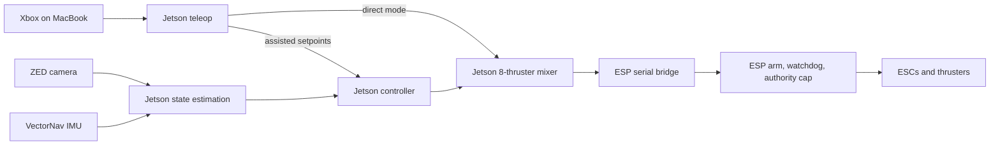

# Tardigrade ROS 2 Workspace

ROS 2 Foxy software for the Berkeley AUV Tardigrade. Development and robot
operation use the same Docker workspace.

## Current Architecture

The Jetson owns sensing, state estimation, teleop, PID control, and thruster
mixing. The ESP32 is a bounded actuator and independent safety layer.



The Jetson does **not** forward pose to the ESP during normal operation. Do not
run the firmware repository's `pose_bridge.py`, `gcs_server.py --ros`, or the
ROS synthetic-pose test hook with the Jetson controller.

## Canonical Guides

- [Pool runbook](docs/pool_teleop.md): complete build, network, sensor,
  Foxglove, Xbox, thruster, teleop, recording, and PID procedure.
- [Roll PID tuning](docs/roll_pid_tuning.md): focused first-day roll-only
  procedure and Foxglove tuning station.
- [Runtime modes](docs/runtime_modes.md): short command reference.
- [Coordinate frames](docs/coordinate_frames.md): `map`, `odom`, `base_link`,
  sensor mounting, and sign checks.
- [Thruster mapping](docs/thruster_mapping.md): slots, pins, coefficients, and
  physical verification.
- [Jetson control architecture](docs/jetson_control_architecture.md): ownership
  and safety boundaries.
- [Foxglove setup](foxglove/README.md): connection, layouts, and MacBook Xbox
  extension.
- [Development setup](SETUP.md), [scripts](SCRIPTS.md), and
  [robot host setup](robot/README.md).

## Clone And Build

Clone recursively so the VectorNav and ZED sources are present:

```bash
git clone --recurse-submodules https://github.com/berkeleyauv/tardigrade_ws.git
cd tardigrade_ws
```

Local development container:

```bash
./docker-build.sh --build
```

Inside the container:

```bash
cd /ws
rosdep update
rosdep install --from-paths src --ignore-src -r -y
./build.sh
source install/setup.bash
```

The default build skips hardware-only ZED SDK packages. On the Jetson use:

```bash
./build.sh --hardware
source install/setup.bash
```

After deleting or renaming launch files, use a clean hardware build so stale
installed launch files disappear:

```bash
./build.sh --clean --hardware
source install/setup.bash
```

## Common Commands

Local simulator:

```bash
ros2 launch tardigrade_sim local_sim.launch.py
```

VectorNav only on the current robot:

```bash
ros2 launch tardigrade_bringup vectornav_state.launch.py \
  port:=/dev/serial/by-id/usb-FTDI_USB-RS232-WE_AV0LN035-if00-port0 \
  baud:=115200
```

Foxglove transport:

```bash
ros2 launch tardigrade_bringup foxglove_rosbridge.launch.py
```

Bounded individual-thruster checkout:

```bash
ros2 launch tardigrade_esp thruster_checkout_real.launch.py \
  serial_port:=/dev/serial/by-id/usb-Silicon_Labs_CP2102_USB_to_UART_Bridge_Controller_0001-if00-port0
```

Direct pool teleop, with `/joy` published by Foxglove on the MacBook:

```bash
ros2 launch tardigrade_bringup pool_direct.launch.py
```

Assisted teleop after the state-estimation and direct-mode gates pass:

```bash
ros2 launch tardigrade_bringup pool_assisted.launch.py
```

Only one load-bearing mode may run at once. `thruster_checkout_real`,
`pool_direct`, and `pool_assisted` each start their own ESP bridge.

## Stable Robot Ports

Current hardware identities:

```text
VectorNav  /dev/serial/by-id/usb-FTDI_USB-RS232-WE_AV0LN035-if00-port0
ESP32      /dev/serial/by-id/usb-Silicon_Labs_CP2102_USB_to_UART_Bridge_Controller_0001-if00-port0
```

Confirm them after hardware changes:

```bash
ls -l /dev/serial/by-id/
```

Never rely on `/dev/ttyUSB0` versus `/dev/ttyUSB1`; those numbers can swap.

## Testing

```bash
./build.sh
colcon test --packages-select \
  tardigrade_interfaces \
  tardigrade_state_estimation \
  tardigrade_esp \
  tardigrade_teleop \
  tardigrade_bringup \
  tardigrade_mission \
  tardigrade_sim
colcon test-result --verbose
```

Hardware operation additionally requires every go/no-go gate in the
[pool runbook](docs/pool_teleop.md).

## Safety

- Keep thruster power disconnected until command signs and stop behavior are
  verified.
- Keep one person assigned to the physical kill switch during powered tests.
- Use exactly one ESP serial owner and one thruster-command source.
- Release LB, disarm, and remove thruster power before troubleshooting.
- Never treat an estimator, joystick, network, or watchdog failure as something
  to work around; it blocks powered testing.
