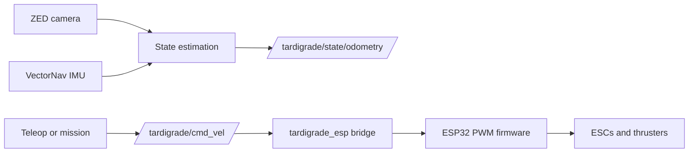

# Tardigrade ROS 2 Workspace

This repository contains the ROS 2 Foxy workspace for the Berkeley AUV
Tardigrade. Development is Docker-based so laptops and the Jetson use the same
ROS toolchain.

Most day-to-day work can happen locally without the ZED, VectorNav, ESP32, or
thrusters.

## Contents

- [System Flow](#system-flow)
- [Repository Guides](#repository-guides)
- [Clone](#clone)
- [Build Packages](#build-packages)
- [Run Code](#run-code)
- [Foxglove](#foxglove)
- [Foxglove Live Bring-Up (Real ESP)](#foxglove-live-bring-up-real-esp)
- [Testing](#testing)
- [Safety Notes](#safety-notes)

## System Flow

The current hardware direction is ESP-first:



For local development, `tardigrade_sim` can replace hardware with fake status,
odometry, and perception topics.

## Repository Guides

- [SETUP.md](SETUP.md): set up the repo, Docker container, Jetson host, and
  Foxglove.
- [SCRIPTS.md](SCRIPTS.md): root helper scripts, launch files, and ROS console
  commands.
- [CONTRIBUTING.md](CONTRIBUTING.md): local checks and PR expectations.
- [robot/README.md](robot/README.md): robot-host setup, udev rules, and
  autostart files.
- [foxglove/README.md](foxglove/README.md): visualization setup and layout
  notes.
- [docs/pool_teleop.md](docs/pool_teleop.md): dry checks and the supported
  keyboard teleop procedure for tethered pool testing.
- [docs/](docs): detailed runbooks that should version with the code.

## Clone

Clone recursively so vendor submodules are present:

```bash
git clone --recurse-submodules https://github.com/berkeleyauv/tardigrade_ws.git
cd tardigrade_ws
```

If the repo was cloned without submodules:

```bash
git submodule update --init --recursive
```

External source layout:

```text
src/vectornav             VectorNav ROS 2 driver/messages
src/zed-ros2-wrapper      Stereolabs ZED wrapper
  zed-ros2-interfaces     Nested submodule owned by zed-ros2-wrapper
src/ROS-TCP-Endpoint      Unity ROS-TCP endpoint
```

## Build Packages

Start the development container:

```bash
./docker-build.sh --build
```

Inside the container:

```bash
cd /ws
rosdep update
rosdep install --from-paths src --ignore-src -r -y
./build.sh
source install/setup.bash
```

`./build.sh` skips ZED SDK packages by default because those only build on the
Jetson or another machine with the Stereolabs SDK installed.

## Run Code

For local development without hardware:

```bash
ros2 launch tardigrade_bringup mock.launch.py
```

For ESP thruster bridge testing after the workspace is built:

```bash
ros2 run tardigrade_esp esp_thruster_bridge --ros-args \
  -p serial_port:=/dev/ttyUSB0 \
  -p config_file:=/ws/config/esp_thruster_map.json
```

In another terminal:

```bash
ros2 run tardigrade_teleop keyboard_cmd_vel
```

The full Jetson/ESP/ZED procedure is documented in
[docs/esp_thruster_bringup.md](docs/esp_thruster_bringup.md).

## Foxglove

Foxglove is the bench and pool-test visualization UI.

Start rosbridge inside the container:

```bash
ros2 launch tardigrade_bringup foxglove_rosbridge.launch.py
```

Connect Foxglove with the Rosbridge connection type:

```text
ws://localhost:9090
```

On the Jetson, replace `localhost` with the Jetson IP address. See
[foxglove/README.md](foxglove/README.md) for layout notes and bridge details.

## Foxglove Live Bring-Up (Real ESP)

End-to-end steps to go from "nothing running" to live ESP telemetry, arming,
and per-thruster bench testing in Foxglove — the F1 telemetry bridge plus the
motor-test/arm subset of F2 from
[foxglove_integration.md](../tardigrade_firmware/docs/foxglove_integration.md).

### 1. Attach the ESP (Windows laptop only — skip on the Jetson)

The ESP shows up as a native serial device on the Jetson already. On a Windows
laptop it has to be forwarded into WSL2 first:

```bash
usbipd list
```

```bash
usbipd attach --wsl --busid <busid>
```

(Run this in an elevated/Administrator PowerShell. `<busid>` comes from the
`usbipd list` output — look for the CP210x/CH340/FTDI USB-serial device.)

### 2. Start the container

Laptop bench (maps the ESP's serial device in via `docker/compose.esp.yaml`):

```bash
./docker-build.sh --esp --detached
```

Jetson (full `/dev` passthrough already, see `docker/compose.jetson.yaml` —
don't combine with `--esp`):

```bash
sudo env WORKSPACE=/home/auv/Developer/tardigrade_ws ./docker-build.sh --jetson --detached
```

`--detached` matters here: without it the container is tied to your current
shell/SSH session and dies if that session drops.

### 3. Find the ESP's port and build

```bash
docker exec -it tardigrade-foxy bash
```

```bash
ls -l /dev/ttyUSB* /dev/ttyACM* /dev/serial/by-id/
```

Match the device against its `by-id` name (e.g. `CP2102` / `CP210x` is the
ESP32; an `FTDI` adapter is more likely the VectorNav).

**Port numbers are not stable — re-run this check after every power cycle or
reboot, not just once.** `ttyUSB0` and `ttyUSB1` can (and did, during real
testing) swap which physical device they point to after the ESP or the Jetson
loses power. `esp_bridge` will start and look healthy pointed at the wrong
port — it just silently gets no valid replies, which looks identical to a
dead/disconnected ESP (`GetState` and `Arm` both time out with no error
beyond a generic warning). If arming or telemetry stops working after any
power event, **check `/dev/serial/by-id/` again before assuming anything else
is broken.**

```bash
./build.sh --pkg tardigrade_esp
source install/setup.bash
```

(First build on a fresh checkout: run `./build.sh` with no `--pkg` instead, so
`tardigrade_interfaces` and other dependencies build too. If colcon errors
with "Duplicate package names not supported," some other package — e.g. a
stale `px4_msgs` checkout — is colliding; `touch` a `COLCON_IGNORE` file in
the stale one rather than deleting anything, and check `git status` on it
first to see if it's actually tracked before assuming it's disposable.)

### 4. Run the bridge

```bash
ros2 run tardigrade_esp esp_bridge --ros-args -p serial_port:=/dev/ttyUSB1
```

**Give this its own terminal/tmux pane and never type another command into
that pane again** — not even a diagnostic one. A stray Ctrl-C or a command
typed into this same window kills the bridge, and it's easy to not notice:
the last line still on screen is the calm startup banner, so it looks like
it's still running. If telemetry or arming mysteriously stops working, the
first thing to check is whether this process is still alive
(`ros2 node list` should show `/esp_bridge`) before debugging anything else.

Before starting a second `esp_bridge` anywhere, check `ros2 node list` first
— two processes fighting over the same serial port fails with "device
disconnected or multiple access on port," and looks like a hardware problem.

### 5. Start rosbridge

New shell, same container — same rule applies, this pane is now spoken for:

```bash
docker exec -it tardigrade-foxy bash
```

```bash
source install/setup.bash
fg
```

Leave this running too (`fg` is the `docker/ros_bashrc.sh` alias for
`ros2 launch tardigrade_bringup foxglove_rosbridge.launch.py`). Use a *third*
pane for `ros2 node list`, `ros2 topic hz`, `ros2 service list`, and any other
one-off check — never the panes running step 4 or step 5.

### 6. Connect Foxglove

Open [app.foxglove.dev](https://app.foxglove.dev) (or Foxglove Desktop) →
**Open connection** → **Rosbridge (ROS 1 & 2)** →

```text
ws://localhost:9090          # same laptop
ws://<jetson-ip>:9090        # Jetson — get the IP from `ip addr` on the Jetson
```

Add a **Raw Messages** panel on `/tardigrade/esp/state` to confirm live
telemetry (not stale/fake data — `fake_esp_state` and `esp_bridge` publish the
same topic, so don't run both at once).

**Multiple laptops connecting at once** (F3) only works if they're on a
network that actually routes between them — a laptop-to-Jetson USB
tether/Windows Mobile Hotspot (`192.168.137.x`) only reaches the one laptop
providing it. Use a phone hotspot or a dedicated router instead, and watch out
for client/AP isolation on venue Wi-Fi, which silently blocks device-to-device
traffic even on the same network.

### 7. Arm and test a thruster

Add a **Service Call** panel: service name `/tardigrade/set_armed`, request
`{"armed": true}` → **Call service** → confirm `armed` flips to `true` in the
state panel.

**Kill-switch duty and clear thrusters before this step** — see
[foxglove_integration.md's safety model](../tardigrade_firmware/docs/foxglove_integration.md#safety-model-physical-kill-switch-not-a-software-presence-beacon).

Add a **Publish** panel on `/tardigrade/thrusters/cmd`
(`std_msgs/Float32MultiArray`). Edit the `data` array — one index nonzero,
rest zero:

```json
"data": [0, 0, 0, 0.15, 0, 0, 0, 0]
```

**Publish**, observe, then zero it and publish again immediately. Index
position = thruster slot, see
[docs/thruster_mapping.md](docs/thruster_mapping.md). The firmware clamps
bench motor-test throttle to ±0.30 regardless of what's sent
(`Safety::commandMotor`'s `test_limit_`), so this can't overdrive a thruster.

Disarm when done: same Service Call panel, `{"armed": false}`.

### 8. Bench-test the sensor/pose-timeout failsafe (optional)

Nothing normally sends `Pose` frames through `esp_bridge` (that's
`gcs_server.py --ros` / `pose_bridge.py`'s job in the firmware repo, not run
here), so the ESP's estimate can never go "healthy" and the sensor-timeout
failsafe can never fire on a bench sub with no EKF running. `esp_bridge`
exposes `/tardigrade/test/synthetic_pose` (`std_msgs/Bool`) as a **temporary,
bench-only** way to fake a healthy pose feed for exactly this test.

```json
{"data": true}
```
Publish that to `/tardigrade/test/synthetic_pose`, confirm `state_valid`/
`altitude_valid` go `true`, then arm. Publish `{"data": false}` and confirm
`armed`, `state_valid`, and `altitude_valid` all drop to `false` within
~100 ms — with the heartbeat still running the whole time, so it can only be
`SensorTimeout`, not the link-timeout from step 7.

**Trap: this permanently changes vehicle behavior for the rest of that ESP
boot.** `ever_healthy` in `main.cpp` is a one-way latch — once the estimate
has been healthy even once, the ESP's onboard `RobosubController` +
`RobosubMixer` control loop activates whenever `armed && healthy`, and it
**writes to every motor on every loop tick**, overriding manual
`SetMotor`/`/tardigrade/thrusters/cmd` commands almost as fast as you can send
them. If thrusters stop responding to manual commands after running this
test, that's why — not a bug. To get back to plain manual bench testing,
**power-cycle or press the ESP's physical reset/EN button** (clears
`ever_healthy`; no reflash needed) and don't touch `synthetic_pose` again
this session.

### Troubleshooting

Problems actually hit while running the above, roughly in the order you're
likely to hit them:

**`permission denied ... docker.sock`** — your user isn't in the `docker`
group. Prefix commands with `sudo` (`sudo docker ps`, `sudo docker exec ...`),
or run `sudo usermod -aG docker $USER` once and log out/in for it to stick.

**`docker ps` shows nothing after a Jetson reboot** — the container does not
survive a host reboot/power loss on its own. Check `sudo docker ps` first
before assuming your bridge/rosbridge processes are still running; if it's
empty, restart with `./docker-build.sh --jetson --detached` (step 2) before
doing anything else.

**`fatal: detected dubious ownership in repository at '/ws'`** — a git
security check tripping because the container runs as `root` but `/ws` is a
bind mount owned by your host user. Run
`git config --global --add safe.directory /ws` inside the container (once per
container instance — it doesn't persist across container recreation).

**`Arm`/telemetry time out with no clear error** — almost always the port
swap described in step 3, or a dead pane from step 4's warning. Check
`/dev/serial/by-id/` and `ros2 node list` before anything else.

**`esp_bridge`/`fg` "stopped working" for no visible reason** — check whether
that pane's process is still alive (see step 4). Killing it by accident
(directly or by reusing its terminal) is more likely than an actual hardware
fault.

**Multiple laptops can't both connect** — see the networking note above
(step 6): a laptop-to-Jetson tether only reaches the laptop providing it, and
venue Wi-Fi may have client isolation enabled. Neither is a ROS/Foxglove
problem.

## Testing

Useful local checks:

```bash
./build.sh
colcon test --packages-select \
  tardigrade_interfaces \
  tardigrade_state_estimation \
  tardigrade_esp \
  tardigrade_teleop \
  tardigrade_bringup \
  tardigrade_mission \
  tardigrade_sim
colcon test-result --verbose
```

GitHub Actions runs the Docker build and active package tests on PRs and pushes
to `main`.

## Safety Notes

- Keep thruster power disconnected until sensor, command, and mapping checks
  look sane.
- Verify [config/esp_thruster_map.json](config/esp_thruster_map.json) and
  [docs/thruster_mapping.md](docs/thruster_mapping.md) against the physical
  vehicle before commanding real thrust.
- Keep arming and external-control enable explicit; do not hide them inside
  launch files.
