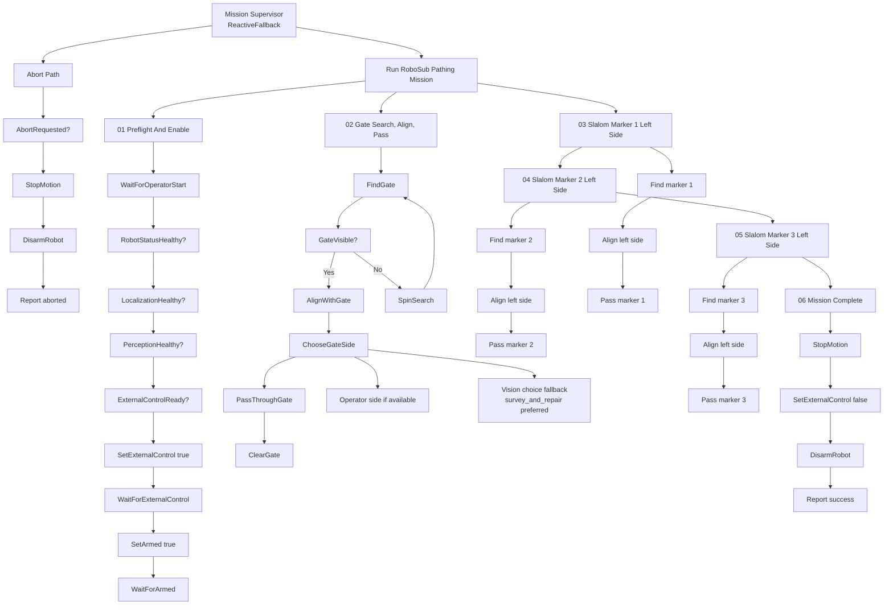

# Pathing Behavior Tree

This document describes the first RoboSub pathing behavior tree for Tardigrade.
The Groot-loadable XML lives at:

```text
behavior_trees/pathing_mission.xml
```

It is a design artifact for now. The node names are intended to become
BehaviorTree.CPP nodes later, with ROS 2 adapters that talk through robot-level
topics and services.

## Mission Shape

The XML is intentionally flattened so Groot shows the main course sequence in
one view instead of hiding the task details behind collapsed subtrees. The
current tree models this course logic:

1. Wait for operator start.
2. Verify robot status, localization, perception, and external-control readiness.
3. Enable external control and arm.
4. Spin-search until the gate is visible.
5. Align with the gate.
6. Choose which side to pass through:
   - `survey_and_repair`
   - `search_and_rescue`
7. Drive through and clear the gate.
8. For each of three slalom markers:
   - search until the marker is visible,
   - align with the marker's left side,
   - pass through on that left-side line.
9. Stop, disable external control, disarm, and report success.

## High-Level Diagram



## Runtime Contracts

These are the intended ROS-level contracts for the future implementation.

`AbortRequested`
: Returns success if the operator, watchdog, leak detector, kill switch, or
  mission supervisor requests an abort.

`RobotStatusHealthy`
: Reads `/tardigrade/status` and fails if PX4 is disconnected, arming checks are
  not ready, or a serious status detail is present.

`LocalizationHealthy`
: Checks `/tardigrade/state/odometry` freshness and sanity. This should catch
  stale ZED pose, bad odometry jumps, or impossible position estimates before
  arming/pathing.

`PerceptionHealthy`
: Confirms the camera/perception stack is publishing fresh detections or fresh
  frames before the mission starts.

`GateVisible`
: Returns success once gate perception has a detection above `min_confidence`.

`SpinSearch`
: Publishes a slow yaw command while the gate is not visible.

`AlignWithGate`
: Uses gate centerline/pose to yaw and translate until the robot is aligned.

`OperatorGateSideAvailable`
: Returns success if the operator has already selected the gate side.

`UseOperatorGateSide`
: Writes the operator-selected side into the `gate_side` blackboard value.

`SelectGateSideFromVision`
: Chooses `survey_and_repair` or `search_and_rescue` from perception. The XML
  currently prefers `survey_and_repair` and falls back to `search_and_rescue`.

`PassThroughGate`
: Publishes forward motion through the selected gate side.

`ClearGate`
: Continues forward after the gate so the vehicle is safely past the structure.

`SlalomMarkerVisible`
: Returns success when the requested slalom marker index is visible.

`SweepSearch`
: Runs a short yaw/search pattern while a slalom marker is not visible.

`AlignWithSlalomLeftSide`
: Aligns the robot to pass on the marker's left-side line with a configurable
  lateral offset.

`DrivePastSlalomMarker`
: Drives forward past the requested marker while holding the left-side alignment.

`SetExternalControl`
: Calls `/tardigrade/set_external_control`.

`SetArmed` and `DisarmRobot`
: Call `/tardigrade/set_armed`.

## Blackboard Values

```text
gate_side       survey_and_repair or search_and_rescue
marker_index    slalom marker number, currently 1, 2, or 3
```

## Implementation Notes

The first real code package should probably be `tardigrade_behavior_tree`. It
can wrap BehaviorTree.CPP and communicate through existing robot-level APIs:

```text
/tardigrade/status
/tardigrade/state/odometry
/tardigrade/cmd_vel
/tardigrade/set_external_control
/tardigrade/set_armed
```

Perception nodes should publish robot-level gate and slalom detections. The
behavior tree should orchestrate mission logic; `tardigrade_px4` should remain
the hardware adapter.
